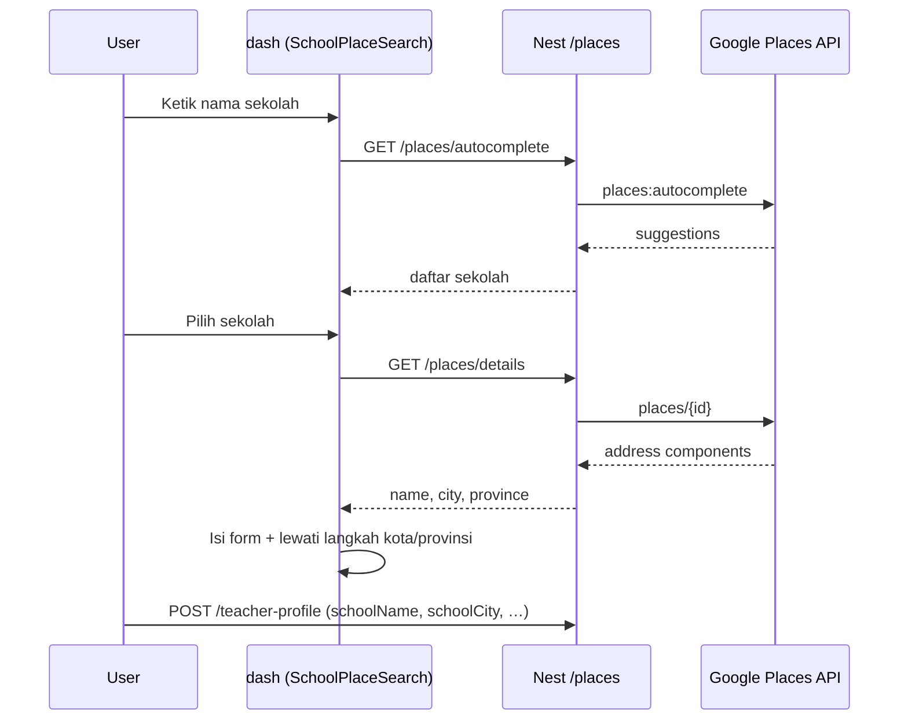

# Google Places API (via Backend)

Dokumentasi modul **`places`** — proxy server-side ke Google Places API (New) untuk pencarian sekolah di onboarding dashboard.

API key **hanya** disimpan di backend (`GOOGLE_MAPS_API_KEY`), tidak diekspos ke browser.

## Prasyarat

1. **Google Cloud Console**
   - Enable **Places API (New)**
   - Buat API key dengan restriction **IP server** (production) atau tanpa referrer restriction untuk development server
2. **Backend `.env`**
   ```env
   GOOGLE_MAPS_API_KEY=AIzaSy...
   ```
3. User harus **login** (Bearer token Supabase) — endpoint dilindungi guard yang sama dengan modul lain.

## Swagger

Jalankan backend:

```bash
cd be
npm run start:dev
```

Buka: [http://localhost:3001/docs](http://localhost:3001/docs)

Tag: **`places`**

## Endpoint

### `GET /places/autocomplete`

Mencari sekolah di Indonesia (autocomplete).

| Query | Wajib | Keterangan |
|-------|-------|------------|
| `input` | Ya | Minimal 2 karakter |
| `sessionToken` | Tidak | Token sesi Google (opsional, billing) |

**Contoh**

```http
GET /places/autocomplete?input=SMA%20Negeri%201%20Surabaya
Authorization: Bearer <supabase_access_token>
```

**Response `200`**

```json
[
  {
    "placeId": "ChIJ…",
    "primaryText": "SMA Negeri 1 Surabaya",
    "secondaryText": "Surabaya, Jawa Timur, Indonesia"
  }
]
```

**Error umum**

| Status | Penyebab |
|--------|----------|
| `401` | Token tidak ada / tidak valid |
| `503` | `GOOGLE_MAPS_API_KEY` belum di-set di server |
| `502` | Google Places menolak request (API belum enable, quota, key salah) |

---

### `GET /places/details`

Detail tempat untuk autofill form onboarding (nama, kota, provinsi, alamat).

| Query | Wajib | Keterangan |
|-------|-------|------------|
| `placeId` | Ya | Dari hasil `autocomplete` |

**Contoh**

```http
GET /places/details?placeId=ChIJN1t_tDeuEmsRUsoyG83frY4
Authorization: Bearer <supabase_access_token>
```

**Response `200`**

```json
{
  "placeId": "places/ChIJ…",
  "name": "SMA Negeri 1 Surabaya",
  "city": "Surabaya",
  "province": "Jawa Timur",
  "district": "Genteng",
  "address": "Jl. …, Surabaya, Jawa Timur, Indonesia",
  "latitude": -7.2575,
  "longitude": 112.7521
}
```

## Alur di Dashboard (onboarding)



Komponen frontend: `dash/components/onboarding/konteks/SchoolPlaceSearch.tsx`  
Client API: `dash/lib/places-api.ts`

## Penyimpanan ke database

Saat onboarding selesai, dashboard mengirim:

```json
{
  "fullName": "…",
  "schoolName": "SMA Negeri 1 Surabaya",
  "schoolCity": "Surabaya",
  "schoolProvince": "Jawa Timur",
  "context": { … }
}
```

Backend (`TeacherProfileService.resolveSchoolId`) membuat atau memperbarui record **`schools`** dengan `name`, `city`, `province`, `address` (jika tersedia).

## File terkait

| Path | Peran |
|------|--------|
| `be/src/modules/places/places.module.ts` | Modul Nest |
| `be/src/modules/places/places.service.ts` | Panggilan Google API |
| `be/src/modules/places/places.controller.ts` | Route HTTP |
| `be/src/config/google-maps.config.ts` | Config env |
| `dash/lib/places-api.ts` | Wrapper fetch dari dashboard |

## Migrasi dari key di frontend

Jika sebelumnya key ada di `dash/.env.local` sebagai `NEXT_PUBLIC_GOOGLE_MAPS_API_KEY`:

1. Pindahkan nilai yang sama ke `be/.env` sebagai `GOOGLE_MAPS_API_KEY`
2. Hapus variabel public di dashboard (tidak diperlukan lagi)
3. Restart backend dan dashboard dev server

## Pengujian manual

```bash
# Ganti TOKEN dan pastikan BE jalan
curl -s "http://localhost:3001/places/autocomplete?input=SMA%20Surabaya" \
  -H "Authorization: Bearer TOKEN" | jq

curl -s "http://localhost:3001/places/details?placeId=PLACE_ID" \
  -H "Authorization: Bearer TOKEN" | jq
```
